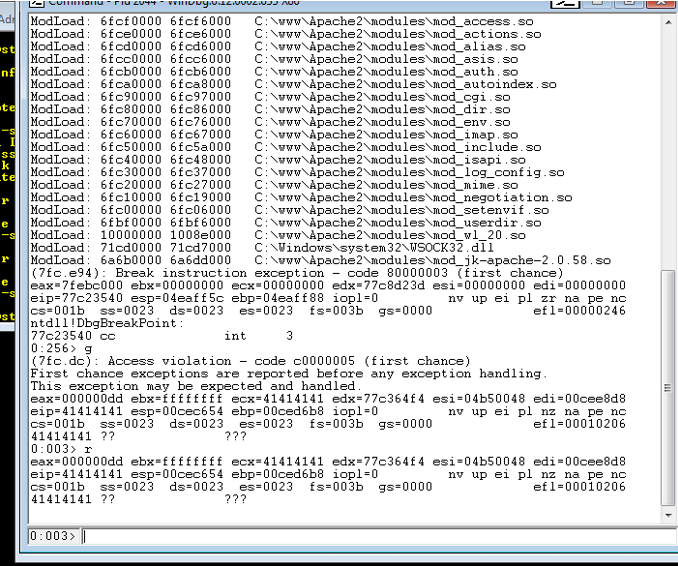
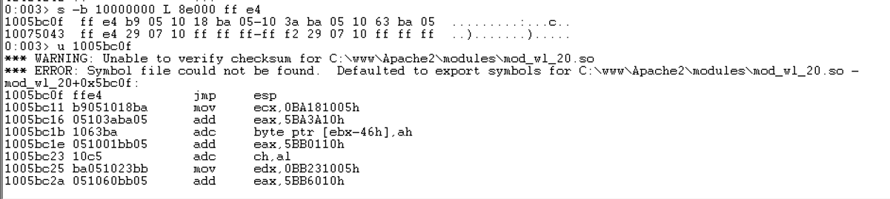
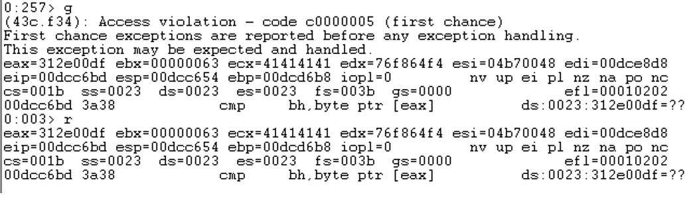

# Apache Buffer Overflow Analysis (WinDbg)

This project documents a stack-based buffer overflow analysis performed against a vulnerable Apache module in a controlled lab environment. The focus of this project is on debugger-driven analysis, memory inspection, and understanding how execution flow can be redirected through precise manipulation of the stack.

---

## 🧠 Overview

The goal of this lab was to analyze a vulnerable web service, identify a buffer overflow condition, and understand how program execution can be controlled at the assembly level.

Rather than treating this as a “black box exploit,” the emphasis was on:
- Understanding how memory is structured during execution
- Observing how crashes occur
- Using debugging tools to trace and control execution flow

---

## 🎯 Objectives

- Trigger a controlled crash in a vulnerable Apache module
- Determine the exact offset required to overwrite the instruction pointer (EIP)
- Analyze memory layout and loaded modules
- Identify a reliable instruction to redirect execution (`jmp esp`)
- Verify execution of controlled instructions on the stack

---

## 🔍 Methodology

### 1. Crash Discovery (Fuzzing)
A large input payload was sent to the `/weblogic/` endpoint to trigger a crash.  
The application terminated with an access violation, confirming the presence of a buffer overflow.

---

### 2. Instruction Pointer Control
Using a cyclic pattern, the exact offset required to overwrite EIP was determined.

- EIP overwritten with known pattern value
- Offset calculated precisely using pattern analysis tools

This confirmed full control over execution flow.

---

### 3. Module & Memory Analysis
Using WinDbg:
- Identified loaded modules and their base addresses
- Verified absence of protections like ASLR and SafeSEH
- Located a reliable `jmp esp` instruction within a module

This provided a stable method to redirect execution.

---

### 4. Execution Redirection
The `jmp esp` instruction was used as a trampoline:

- EIP overwritten with address of `jmp esp`
- CPU redirected to the stack
- Controlled data on the stack treated as instructions

---

### 5. Execution Verification
A sequence of controlled instructions was placed on the stack to verify execution.

- Observed register changes in WinDbg
- Confirmed instructions were executed in order

This demonstrated successful redirection of execution flow.

---

## 🛠 Tools Used

- WinDbg
- Metasploit (pattern_create / pattern_offset)
- Netcat
- Python (payload construction)

---

## 📚 Key Concepts

- Stack-based buffer overflow
- Instruction Pointer (EIP) control
- Little-endian memory representation
- Execution redirection via `jmp esp`
- Debugger-assisted exploit development

---

## 📸 Screenshots

### EIP Overwrite

### JMP ESP Instruction

### Stack Execution Verification

---

## ⚠️ Disclaimer

This project was conducted in a controlled lab environment using intentionally vulnerable software for educational purposes only.

No real-world systems were targeted.

---

## 🧠 Takeaways

This lab emphasized that exploit development is less about “hacking tricks” and more about:
- Careful observation
- Understanding memory behavior
- Iterative debugging

The most valuable takeaway was learning how to move from a simple crash to controlled execution by systematically analyzing the program state.
