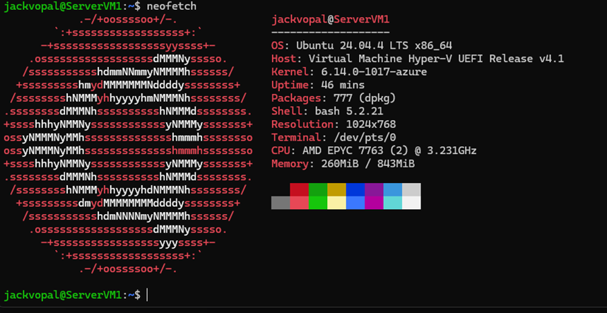
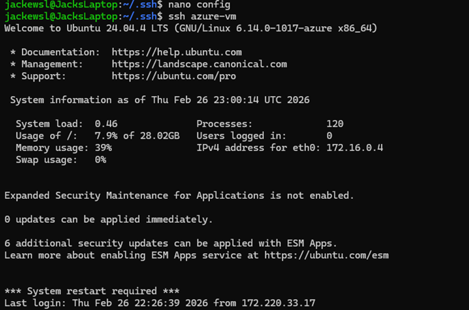
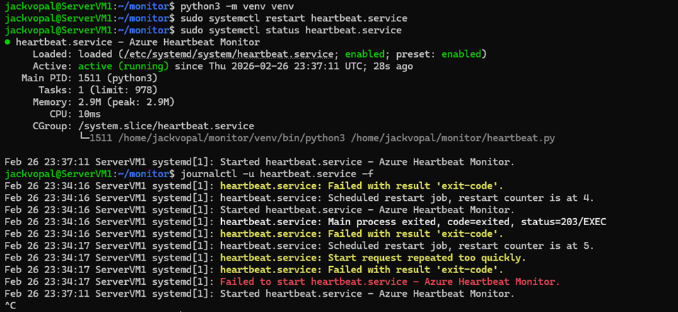
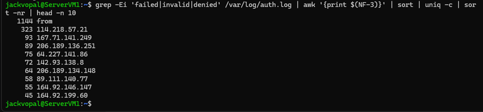
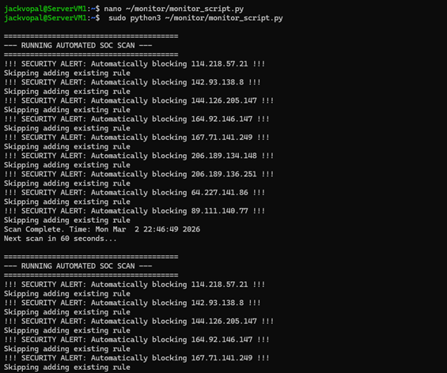
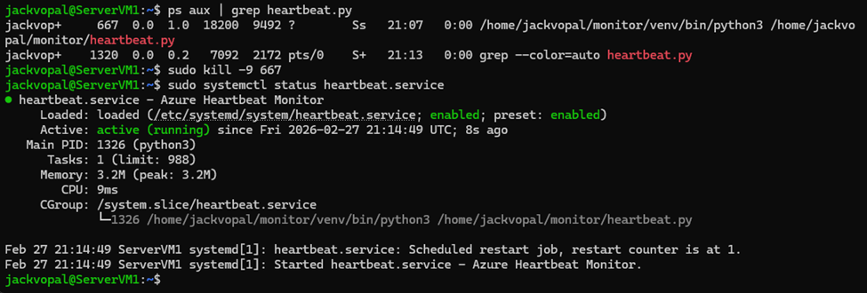

# 🛡️ Cloud-Sentinel: Automated Azure Monitoring & Threat Response

Cloud-Sentinel is a persistent monitoring and intrusion detection solution engineered on an **Ubuntu 24.04 LTS** Azure instance. This project demonstrates the integration of **Python-based telemetry**, **Linux service orchestration (systemd)**, and **active defense automation** to identify and neutralize live brute-force attacks.

---

## 🧠 Overview

The goal of this project was to provision a hardened cloud environment, deploy a self-healing monitoring service, and automate security operations to mitigate real-world attack vectors.

Rather than treating this as a simple script execution, the emphasis was on:
- **Service Persistence**: Ensuring monitoring survives crashes and reboots.
- **Active Defense**: Moving from passive logging to automated firewall mitigation.
- **Cloud Hardening**: Implementing PKI and least-privilege access.

---

## 🎯 Objectives

- Provision a hardened Ubuntu instance in Azure with PKI-based access.
- Develop a Python daemon for real-time system health monitoring.
- Implement **systemd** orchestration for service persistence and automatic recovery.
- Parse system logs to identify and unmask automated brute-force attacks.
- Automate threat mitigation via dynamic **UFW** rule injection.

---

## 🔍 Methodology

### 1. Infrastructure & Secure Access
Provisioned an Ubuntu 24.04 LTS instance on Azure hardware. Initial deployment was verified using `neofetch` to document the environment baseline and system architecture.

Established secure SSH access via PKI and enforced strict file-system permissions (`chmod 400`) on private keys within the WSL environment to ensure identity and access management (IAM) integrity.

---

### 2. Telemetry & Environment Isolation
Developed a Python "Heartbeat" script utilizing the `psutil` library to track CPU, RAM, and Disk utilization. To prevent dependency conflicts, the script was deployed within an isolated **Python Virtual Environment (venv)**.

---

### 3. Service Orchestration (systemd)
The script was converted into a background daemon using a custom **systemd unit file**. During deployment, `journalctl` was utilized to debug and resolve initialization errors, such as **status=203/EXEC** issues related to the virtual environment path.

This implementation utilized `Restart=always` logic to ensure the service remained operational across system failures or reboots.

---

### 4. Forensic Analysis & Automated SOC Loop
Analyzed `/var/log/auth.log` to identify high-frequency failed authentication attempts. Advanced Linux commands were used to unmask automated botnets targeting the system, identifying over **1,300 unique brute-force attempts**.

A decision-based loop was integrated to automatically trigger **UFW (Uncomplicated Firewall)** deny rules, effectively blocking malicious IPs in real-time as they exceeded failure thresholds.

---

### 5. High-Availability Verification
The "self-healing" capability was verified by manually terminating the service process (`kill -9`). Systemd immediately detected the failure and spawned a replacement process, maintaining continuous monitoring uptime.

---

## 🛠️ Tools Used

- **Azure Cloud** (Infrastructure)
- **Python** (psutil / subprocess)
- **systemd** (Service Management)
- **UFW** (Active Defense)
- **Linux Forensics** (grep, awk, journalctl)

---

## 📚 Key Concepts

- **High-Availability (HA)**: Self-healing service architecture.
- **Active Defense**: Automated intrusion response.
- **Cloud Hardening**: PKI, IAM, and Network Security Groups (NSGs).
- **Log Forensics**: Real-time parsing of authentication telemetry.

---

## 📸 Screenshots

### Infrastructure Baseline

### Hardened Remote Access

### Troubleshooting & Journaling

### Forensic Log Analysis

### Automated SOC Loop

### Self-Healing Verification

---

## ⚠️ Disclaimer

This project was conducted in a controlled cloud environment for educational and security research purposes only. No real-world systems were targeted.

---

## 🧠 Takeaways

This project emphasized that cloud operations are as much about **resilience** as they are about deployment. Building a persistent monitoring tool required:
- Understanding the difference between a standalone script and a **managed service**.
- Recognizing that publicly exposed servers face constant automated attacks.
- Implementing iterative troubleshooting workflows to resolve environment-specific execution errors.
